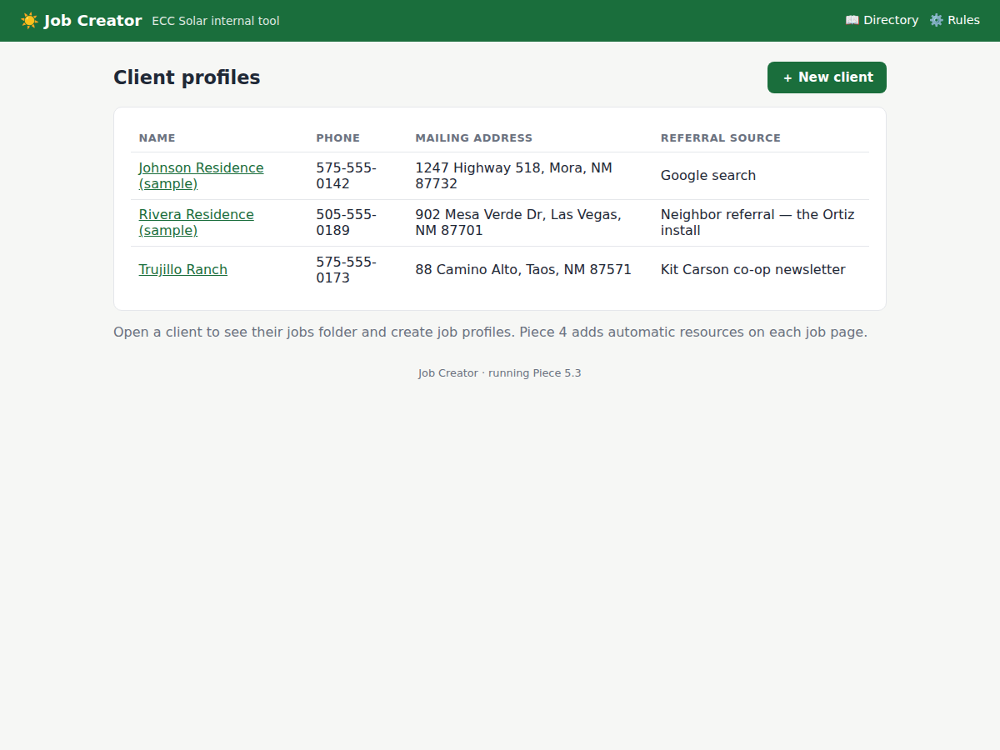
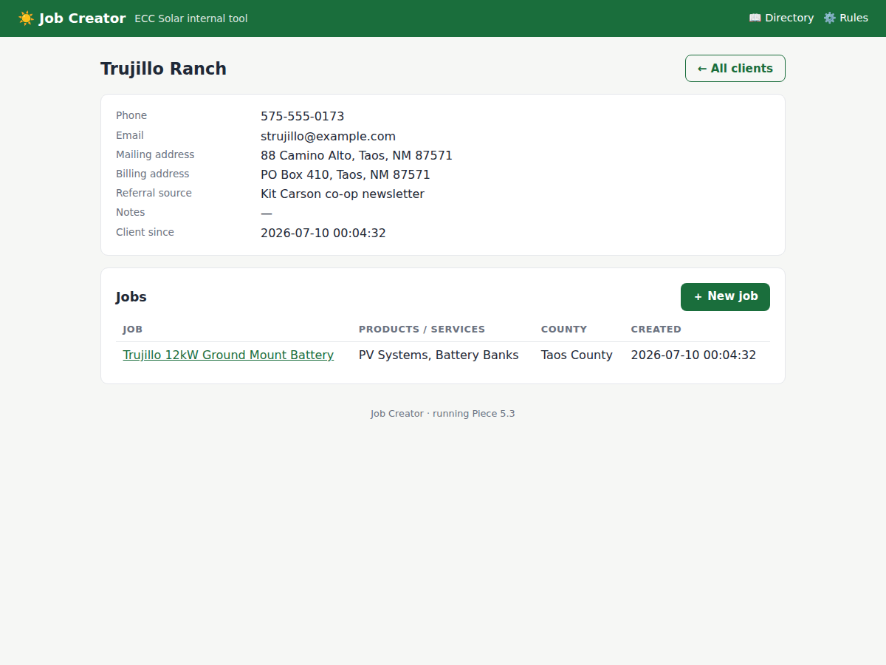
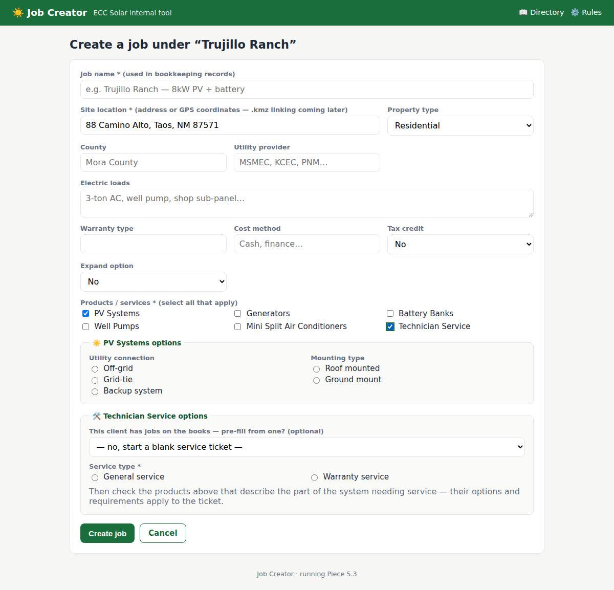
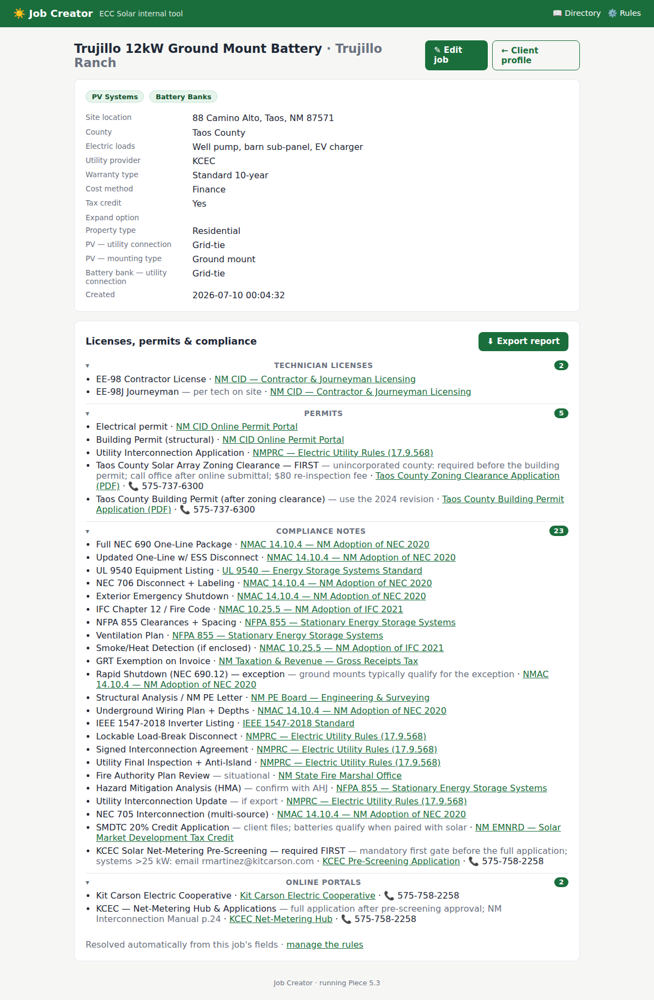
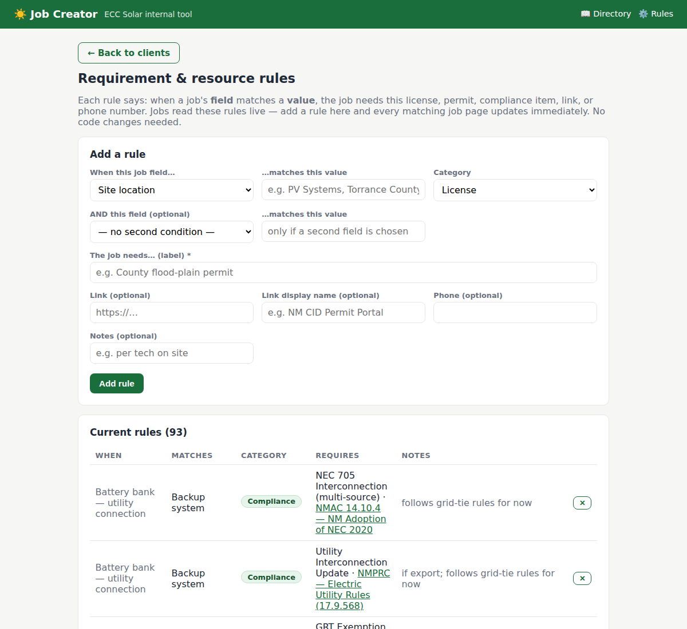
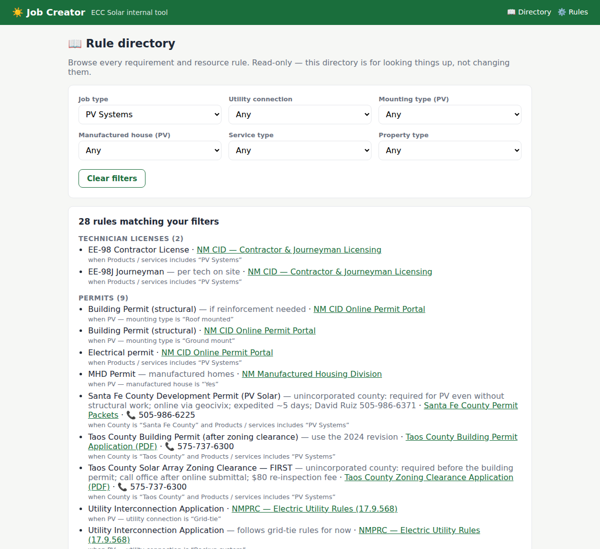

# Compendium — Demo Walkthrough (historical, pre-household-reorg)

**Vixinman Designs internal tool · Proprietary (see LICENSE) · Build: Piece 5.3**

> ⚠️ This walkthrough predates both the Compendium rebrand and the household
> reorg — it describes the old **Job Creator** client → job → compliance demo
> flow, and the client pages/screenshots it references no longer exist (the
> `clients` table was removed in v0.2). Kept as historical reference for the
> rules-engine demo idea, not a current how-to. See the root-level `HANDOFF.md`
> for the app's current shape.

Job Creator manages the client → job → compliance pipeline for Vixinman Designs'
northern New Mexico territory. Its core idea: **enter the job's facts once,
and the tool tells you everything the job requires** — technician licenses,
permits, compliance items, and the exact forms, portals, and phone numbers
for the authorities involved.

## The 5-minute demo script

1. **Clients** (home page) — client profiles with mailing/billing addresses,
   phone, referral source. Click a client to open their folder.

   

2. **Client profile** — everything about the client, plus all of their jobs.
   "＋ New job" creates a job profile in this client's folder.

   

3. **Job form** — Vixinman's real fields: site location (kmz-ready) with
   property type beside it, county and utility provider with pick-lists,
   electric loads, warranty, cost method, tax credit, expand option, and the
   six products/services. Checking a product reveals its options (utility
   connection, PV mounting, manufactured house). Technician Service adds
   general/warranty selection and can pre-fill from a job on the books.
   Utility connection must match across selected products or the save is
   rejected.

   

4. **The payoff — the job page** *(the screenshot to show first)*. The job
   reads its own fields and resolves them against the rules engine. This
   Taos County / KCEC grid-tie ground-mount PV + battery job automatically
   requires: EE-98/EE-98J licenses, the CID electrical permit, **Taos
   County's two-step zoning-clearance-then-building-permit**, **KCEC's
   mandatory pre-screening**, the ground-mount and ESS compliance lists,
   and the SMDTC credit — every line with a named link to the state or
   source website and a phone number where one exists. Categories are
   collapsible with item counts (the future anchor for per-rule document
   uploads). **⬇ Export report** downloads the whole thing as a checklist
   for bookkeeping.

   

5. **Rules manager** — every "if this field, then this requirement" is a
   data row, not code. The office can add or remove rules and every
   matching job updates instantly. 93 rules currently loaded, sourced from
   Vixinman's requirement matrices and the June 2026 reference documents.

   

6. **Rule directory** — read-only, filterable catalog of all rules by job
   type and variant, for looking up requirements without edit risk.

   

7. **Also built in:** job editing with automatic version snapshots for
   recordkeeping (every save archives the prior state, viewable read-only),
   and the same requirements computed for archived versions.

## Running it locally

```
python -m pip install -r requirements.txt
python app.py        # then open http://127.0.0.1:5000
```

Data lives in a local SQLite file created on first run (with two sample
clients). The database upgrades itself in place as the schema evolves —
no manual migrations.

## Technical summary (for the lead developer)

- **Stack:** Flask + SQLite + Jinja templates, no JS framework; one file of
  application code (`app.py`), ~1,100 lines including all seed data.
- **Rules engine:** `resource_rules` table; each rule = one or two
  field/value conditions (equals, or contains for list fields) → a
  categorized requirement with label, notes, URL, link text, phone.
  Matching is `match_rules()` (~20 lines). De-duplication across products
  on job pages; none in the directory.
- **Seed batches:** rule data ships in versioned batches applied exactly
  once per database (`meta.seed_version`), so installs converge without
  duplicating or resurrecting deleted rules.
- **Versioning:** edits snapshot the outgoing job as JSON into
  `job_versions` — schema-proof recordkeeping.
- **Roadmap:** per-rule document uploads reconciled against the category
  counts; .kmz site-file linking; job statuses and search; logins and
  role-based access (directory-only vs. rules editing).
